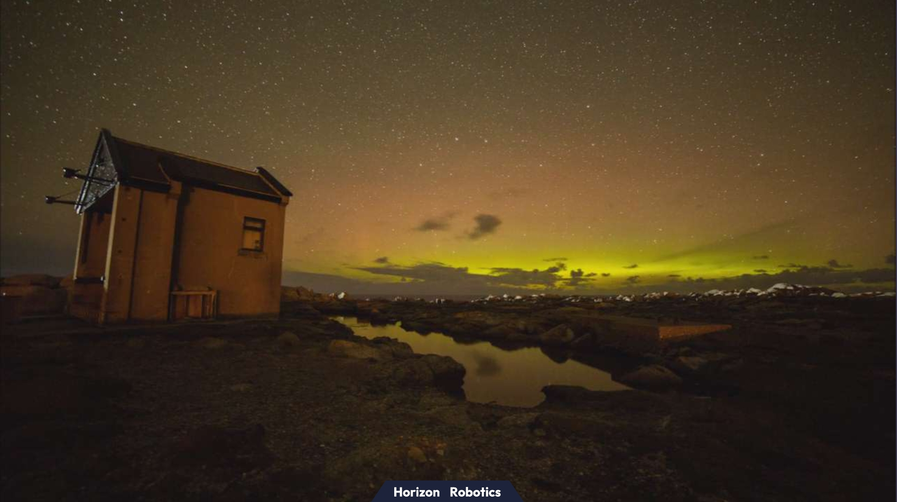

# hobot_image_publisher话题发布节点

# 功能介绍
hobot_image_publisher通过配置参数实现图片数据和视频数据的发布。发布图片时，消息类型为nv12。发布视频时，消息类型根据视频流的编码格式而定。当前支持发布的图片格式有"jpeg", "jpg", "nv12", "png"，视频格式有"mp4", "h264", "h265"。

# 编译

## 依赖库

ros package：

- hbm_img_msgs
- img_msgs

hbm_img_msgs为自定义消息格式，用于发布shared memory类型图像数据，定义在hobot_msgs中。
img_msgs为自定义消息格式，用于发布ros类型的视频流数据，定义在hobot_msgs中。

## 开发环境

- 编程语言: C/C++
- 开发平台: X3/X86
- 系统版本：Ubuntu 20.0.4
- 编译工具链:Linux GCC 9.3.0/Linaro GCC 9.3.0

## 编译

### X3 Ubuntu系统上编译

1、编译环境确认
  - 板端已安装X3 Ubuntu系统。
  - 当前编译终端已设置TogetherROS环境变量：`source PATH/setup.bash`。其中PATH为TogetherROS的安装路径。
  - 已安装ROS2编译工具colcon。安装的ROS不包含编译工具colcon，需要手动安装colcon。colcon安装命令：`pip install -U colcon-common-extensions`

2. 编译
  - 编译命令：`colcon build --packages-select hobot_image_publisher`

### docker交叉编译

1、编译环境确认

- 在docker中编译，并且docker中已经安装好TogetherROS。docker安装、交叉编译说明、TogetherROS编译和部署说明详见机器人开发平台robot_dev_config repo中的README.md。
- 已编译hbm_img_msgs package
- 已编译img_msgs package

2、编译

- 编译命令：

  ```
  export TARGET_ARCH=aarch64
  export TARGET_TRIPLE=aarch64-linux-gnu
  export CROSS_COMPILE=/usr/bin/$TARGET_TRIPLE-

  colcon build --packages-select hobot_image_publisher \
     --merge-install \
     --cmake-force-configure \
     --cmake-args \
     --no-warn-unused-cli \
     -DCMAKE_TOOLCHAIN_FILE=`pwd`/robot_dev_config/aarch64_toolchainfile.cmake
  ```


# 使用介绍

## 参数说明
| 参数名              | 解释                                  | 类型        | 支持的配置                                                   | 是否必须 | 默认值                       |
| ------------------ | ------------------------------------- | ----------- | ------------------------------------------------------------| -------- | ---------------------------- |
| image_source       | 图片/视频文件来源（文件夹/路径/list文件）| std::string | 根据实际文件路径配置                                          | 否        | config/image/test1.jpg        |
| image_format       | 图片/视频格式                          | std::string |   jpeg/jpg/png/nv12/h264/h265/mp4(格式必须与image_source中文件名后缀一致)  |           是       | 无   |
| msg_pub_topic_name | 发布的话题名称                         | std::string |      根据需要发布的话题名称设置                          | 否       | 使用share_mem默认为"/hbmem_img";不使用share_mem默认为"/image_raw" |
| source_image_w     | 源图片的宽度                           | int         | 根据原始图片尺寸配置                                    | 否(若图片格式为nv12则必填)      | 原始图片尺寸 |
| source_image_h     | 源图片的高度                           | int         | 根据原始图片尺寸配置                                   | 否(若图片格式为nv12则必填)     | 原始图片尺寸 |
| output_image_w     | 输出的图片宽度                         | int         | 根据需要发布的图片分辨率设置                                   | 否        | 0 |
| output_image_h     | 输出的图片高度                         | int         | 根据需要发布的图片分辨率设置                                   | 否        | 0 |
| fps                | topic发布帧率(发布视频会自动获取视频编码信息中的fps，如果获取失败则采用此帧率发布) | int         | [1, 30]，在此范围外不做帧率控制                                     | 否       | 10 |
| is_loop            | 是否进行循环发布                       | bool        | True/False                                 | 否       | True |
| is_shared_mem      | 是否使用share_mem的方式通信            | bool        | True/False                                      | 否       | True |

## 注意事项
- 如需使用list指定图片或视频文件，请编写config下的img.list或video.list，注意list文件编写格式:一个文件路径为一行
- 可实现读取文件夹下特定格式的图片、视频
- 文件格式为nv12时，请输入原图片的分辨率，否则会报错
- 目前支持帧率最高为15，超过此帧率无法支持
- 更换图片/视频路径时，请确认参数image_format与图片/视频格式匹配
- 当参数output_image_w和output_image_h设置为0或不设置时，不改变图像分辨率
- 发布视频时，hobot_image_publisher会自动视频的分辨率，所以不关心source_image_w和source_image_h的输入值
- 不支持视频分辨率的更改即输出分辨率等于输入分辨率，所以发布视频时不关心output_image_w和output_image_h的值
- 发布mp4格式视频时，hobot_image_publisher会提取mp4文件中的h264码流，所以发布的topic编码类型为h264

## 运行
- ros2 run运行(请将image_source更换成自己的文件路径)
  ```
  export COLCON_CURRENT_PREFIX=./install
  source ./install/local_setup.bash
  # config中为示例使用的图片和视频文件，根据实际安装路径进行拷贝
  # 如果是板端编译（无--merge-install编译选项），拷贝命令为cp -r install/PKG_NAME/lib/PKG_NAME/config/ .，其中PKG_NAME为具体的package名
  cp -r install/lib/hobot_image_publisher/config/ .
  ```
  依次为读取文件夹/读取图片list文件/读取图片文件/读取视频list文件/读取视频文件
  ```
  ros2 run hobot_image_publisher hobot_image_pub --ros-args -p image_source:=./config -p fps:=5 -p output_image_w:=960 -p output_image_h:=544 -p image_format:=jpg -p source_image_w:=960 -p source_image_h:=544

  ros2 run hobot_image_publisher hobot_image_pub --ros-args -p image_source:=./config/img.list -p fps:=5 -p output_image_w:=960 -p output_image_h:=544 -p image_format:=jpg -p source_image_w:=960 -p source_image_h:=544

  ros2 run hobot_image_publisher hobot_image_pub --ros-args -p image_source:=./config/test1.jpg -p fps:=5 -p output_image_w:=960 -p output_image_h:=544 -p image_format:=jpg -p source_image_w:=960 -p source_image_h:=544

  ros2 run hobot_image_publisher hobot_image_pub --ros-args -p image_source:=./config/video.list -p fps:=30 -p image_format:=mp4

  ros2 run hobot_image_publisher hobot_image_pub --ros-args -p image_source:=./config/test1.h264 -p fps:=30 -p image_format:=h264

  ```

- ros2 launch运行
  ```
  # config中为示例使用的图片和视频文件，根据实际安装路径进行拷贝
  # 如果是板端编译（无--merge-install编译选项），拷贝命令为cp -r install/PKG_NAME/lib/PKG_NAME/config/ .，其中PKG_NAME为具体的package名
  cp -r install/lib/hobot_image_publisher/config/ .
  ```

  1.图片发布效果展示，会启动hobot_codec以及websocket，图片显示于浏览器，请在浏览器中输入IP地址查看，效果见下方效果展示(websocket具体用法参考hobot_websocket)
  ```
  ros2 launch hobot_image_publisher hobot_image_publisher_demo.launch.py
  ```

  2.单独使用hobot_image_publisher节点，该示例读取nv12格式图片，发布话题为/test_msg，参数设置可参考该launch文件
  ```
  ros2 launch hobot_image_publisher hobot_image_publisher.launch.py
  ```

  3.视频发布效果展示，会启动hobot_codec以及websocket，视频显示于浏览器，请在浏览器中输入IP地址查看，效果见下方效果展示(websocket具体用法参考hobot_websocket)
  ```
  ros2 launch hobot_image_publisher hobot_image_publisher_mp4.launch.py
  ```

  4.单独使用hobot_image_publisher节点，该示例读取h264格式图片，发布话题为/test_h264，参数设置可参考该launch文件
  ```
  ros2 launch hobot_image_publisher hobot_image_publisher_h264.launch.py
  ```

## 效果展示
test1.jpg


发布的视频截图

