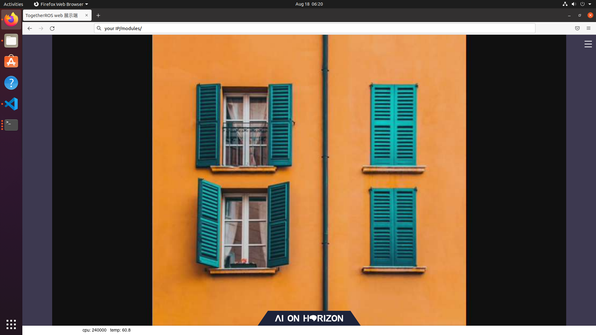
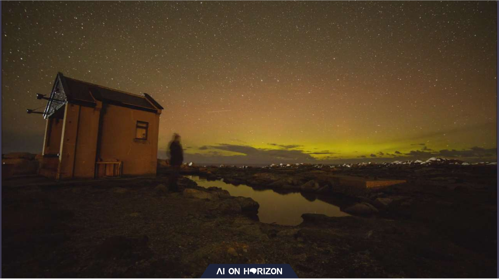

[English](./README.md) | 简体中文

# hobot_image_publisher话题发布节点

# 功能介绍
hobot_image_publisher通过配置参数实现图片数据和视频数据的发布。

1. 支持使用本地图片格式jpeg/jpg/nv12/png进行图片发布。发布图片时，消息类型为nv12。
2. 支持使用本地视频格式mp4/h264/h265进行视频发布。发布h264/h265格式视频时，消息类型就是视频格式h264/h265。
   发布mp4格式视频时，hobot_image_publisher会从mp4文件中提取h264视频码流后再发布，发布的消息类型为h264。

# 编译

## 依赖库

ros package：

- hbm_img_msgs
- img_msgs

hbm_img_msgs为自定义消息格式，用于发布shared memory类型图像数据，定义在hobot_msgs中。
img_msgs为自定义消息格式，用于发布ros类型的视频流数据，定义在hobot_msgs中。

## 开发环境

- 编程语言: C/C++
- 开发平台: X3/X86
- 系统版本：Ubuntu 20.04
- 编译工具链:Linux GCC 9.3.0/Linaro GCC 9.3.0

## 编译

### X3 Ubuntu系统上编译X3版本

1. 编译环境确认
  - 板端已安装X3 Ubuntu系统。
  - 当前编译终端已设置TogetherROS环境变量：`source PATH/setup.bash`。其中PATH为TogetherROS的安装路径。
  - 已安装ROS2编译工具colcon。安装的ROS不包含编译工具colcon，需要手动安装colcon。colcon安装命令：`pip install -U colcon-common-extensions`

2. 编译
  - 编译命令：`colcon build --packages-select hobot_image_publisher`

### docker交叉编译X3版本

1. 编译环境确认

- 在docker中编译，并且docker中已经安装好TogetherROS。docker安装、交叉编译说明、TogetherROS编译和部署说明详见机器人开发平台robot_dev_config repo中的README.md。
- 已编译hbm_img_msgs package
- 已编译img_msgs package

2. 编译

- 编译命令：

  ```
  export TARGET_ARCH=aarch64
  export TARGET_TRIPLE=aarch64-linux-gnu
  export CROSS_COMPILE=/usr/bin/$TARGET_TRIPLE-

  colcon build --packages-select hobot_image_publisher \
     --merge-install \
     --cmake-force-configure \
     --cmake-args \
     --no-warn-unused-cli \
     -DCMAKE_TOOLCHAIN_FILE=`pwd`/robot_dev_config/aarch64_toolchainfile.cmake
  ```

### X86 Ubuntu系统上编译X86版本

1. 编译环境确认

- X86 Ubuntu版本：Ubuntu20.04
- Opencv：4.2.0

2. 编译

- 编译命令：

  ```
  colcon build --packages-select hobot_image_publisher \
     --merge-install \
     --cmake-args \
     -DPLATFORM_X86=ON \ 
     -DTHIRD_PARTY=`pwd`/../sysroot_docker \
  ```

# 使用介绍

## 参数说明
| 参数名              | 解释                                  | 类型        | 支持的配置                                                   | 是否必须 | 默认值                       |
| ------------------ | ------------------------------------- | ----------- | ------------------------------------------------------------| -------- | ---------------------------- |
| image_source       | 图片/视频文件来源（文件夹/路径/list文件）| std::string | 根据实际文件路径配置                                          | 否        | config/image/test1.jpg        |
| image_format       | 图片/视频格式                          | std::string |   jpeg/jpg/png/nv12/h264/h265/mp4(格式必须与image_source中文件名后缀一致)  |           是       | 无   |
| msg_pub_topic_name | 发布的话题名称                         | std::string |      根据需要发布的话题名称设置                          | 否       | 使用share_mem默认为"/hbmem_img";不使用share_mem默认为"/image_raw" |
| source_image_w     | 源图片的宽度                           | int         | 根据原始图片尺寸配置                                    | 否(若图片格式为nv12则必填)      | 原始图片尺寸 |
| source_image_h     | 源图片的高度                           | int         | 根据原始图片尺寸配置                                   | 否(若图片格式为nv12则必填)     | 原始图片尺寸 |
| output_image_w     | 输出的图片宽度                         | int         | 根据需要发布的图片分辨率设置                                   | 否        | 0 |
| output_image_h     | 输出的图片高度                         | int         | 根据需要发布的图片分辨率设置                                   | 否        | 0 |
| fps                | topic发布帧率(发布视频会自动获取视频编码信息中的fps，如果获取失败则采用此帧率发布) | int         | [1, 30]，在此范围外不做帧率控制                                     | 否       | 10 |
| is_loop            | 是否进行循环发布                       | bool        | True/False                                 | 否       | True |
| is_shared_mem      | 是否使用share_mem的方式通信            | bool        | True/False                                      | 否       | True |
| is_compressed_img_pub | 是否直接发布jpeg/jpg/png格式的压缩图片 | bool     | True：直接发布压缩图片；False：将图片解码成NV12格式后发布 | 否       | False |

## 注意事项
- 如需使用list指定图片或视频文件，请编写config下的img.list或video.list，注意list文件编写格式:一个文件路径为一行。
- 使用list文件时，list中的文件格式需要与参数image_format保持一致。list中的所有图片/视频分辨率都要相同,否则会解码失败。
- 使用list文件发布nv12图片时，list中的图片分辨率需要与输入的分辨率保持一致。
- 可实现读取文件夹下特定格式的图片、视频
- 文件格式为nv12时，请输入原图片的分辨率，否则会报错
- 目前支持帧率最高为15，超过此帧率无法支持
- 更换图片/视频路径时，请确认参数image_format与图片/视频格式匹配
- 当参数output_image_w和output_image_h设置为0或不设置时，不改变图像分辨率
- 发布视频时，hobot_image_publisher会自动获取视频的分辨率，且不支持分辨率更改，分辨率配置无效
- 发布图片时，只有当图片格式image_format为jpeg/jpg/png格式时，is_compressed_img_pub参数生效

## 运行
- ros2 run运行(请将image_source更换成自己的文件路径)
  ```
  export COLCON_CURRENT_PREFIX=./install
  source ./install/local_setup.bash
  # config中为示例使用的图片和视频文件，根据实际安装路径进行拷贝
  # 如果是板端编译（无--merge-install编译选项），拷贝命令为cp -r install/PKG_NAME/lib/PKG_NAME/config/ .，其中PKG_NAME为具体的package名
  cp -r install/lib/hobot_image_publisher/config/ .
  ```
  读取文件夹中所有格式为jpg的图片，并以帧率为5的频率发布nv12图片数据
  ```
  ros2 run hobot_image_publisher hobot_image_pub --ros-args -p image_source:=./config -p fps:=5 -p output_image_w:=960 -p output_image_h:=544 -p image_format:=jpg -p source_image_w:=960 -p source_image_h:=544
  ```
  读取./config/test1.jpg图片，发布jpg格式图片数据
  ```
  ros2 run hobot_image_publisher hobot_image_pub --ros-args -p image_source:=./config/test1.jpg -p output_image_w:=960 -p output_image_h:=544 -p image_format:=jpg -p is_compressed_img_pub:=True
  ```
  读取img.list文件，获取img.list中列出的所有格式为jpg的图片路径，发布nv12图片数据，帧率为5
  ```
  ros2 run hobot_image_publisher hobot_image_pub --ros-args -p image_source:=./config/img.list -p fps:=5 -p output_image_w:=960 -p output_image_h:=544 -p image_format:=jpg -p source_image_w:=960 -p source_image_h:=544
  ```
  读取./config/test1.jpg图片并发布，发布帧率为5
  ```
  ros2 run hobot_image_publisher hobot_image_pub --ros-args -p image_source:=./config/test1.jpg -p fps:=5 -p output_image_w:=960 -p output_image_h:=544 -p image_format:=jpg -p source_image_w:=960 -p source_image_h:=544
  ```
  读取视频list文件video.list，获取video.list中列出的所有格式为mp4的视频文件路径，并发布视频topic，topic类型为h264
  ```
  ros2 run hobot_image_publisher hobot_image_pub --ros-args -p image_source:=./config/video.list -p fps:=30 -p image_format:=mp4
  ```
  读取视频文件test1.h264，视频格式为h264，发布h264视频流topic
  ```
  ros2 run hobot_image_publisher hobot_image_pub --ros-args -p image_source:=./config/test1.h264 -p fps:=30 -p image_format:=h264

  ```

- ros2 launch运行
  ```
  # config中为示例使用的图片和视频文件，根据实际安装路径进行拷贝
  # 如果是板端编译（无--merge-install编译选项），拷贝命令为cp -r install/PKG_NAME/lib/PKG_NAME/config/ .，其中PKG_NAME为具体的package名
  cp -r install/lib/hobot_image_publisher/config/ .
  ```

  1.图片发布效果展示，会启动hobot_codec以及websocket，图片显示于浏览器，请在浏览器中输入"IP地址:8000"查看，效果见下方效果展示(websocket具体用法参考hobot_websocket)
  ```
  ros2 launch hobot_image_publisher hobot_image_publisher_demo.launch.py
  ```

  2.单独使用hobot_image_publisher节点，该示例读取nv12格式图片，发布话题为/test_msg，参数设置可参考该launch文件
  ```
  ros2 launch hobot_image_publisher hobot_image_publisher.launch.py
  ```

  3.视频发布效果展示，会启动hobot_codec以及websocket，视频显示于浏览器，请在浏览器中输入"IP地址:8000"查看（由于目前X86版本的hobot_codec不支持h264/h265的解码，该命令仅支持X3派版本运行），效果见下方效果展示(websocket具体用法参考hobot_websocket)。该示例读取video.list文件，并循环发布视频，发布话题为/hbmem_img，参数设置可参考该launch文件。
  
  ```
  ros2 launch hobot_image_publisher hobot_image_publisher_videolist_demo.launch.py
  ```

  4.单独使用hobot_image_publisher节点，该示例读取h264格式图片，发布话题为/test_h264，参数设置可参考该launch文件
  ```
  ros2 launch hobot_image_publisher hobot_image_publisher_video_demo.launch.py
  ```

## 效果展示
test1.jpg


发布的视频截图

